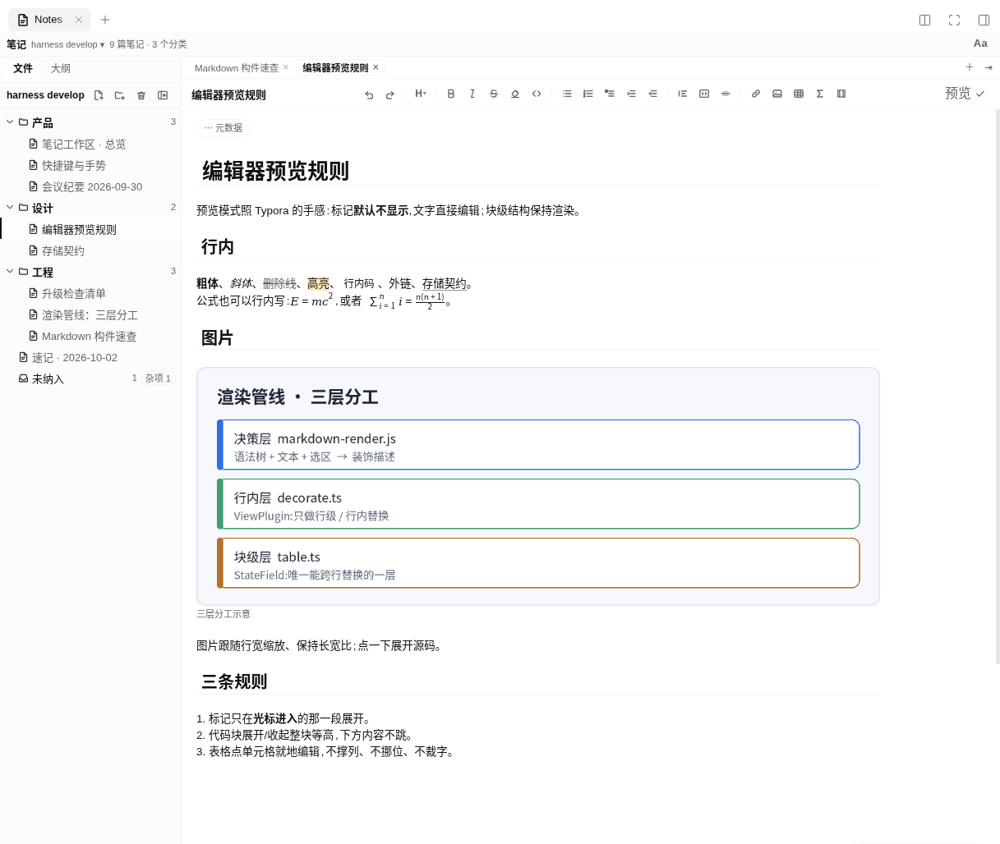
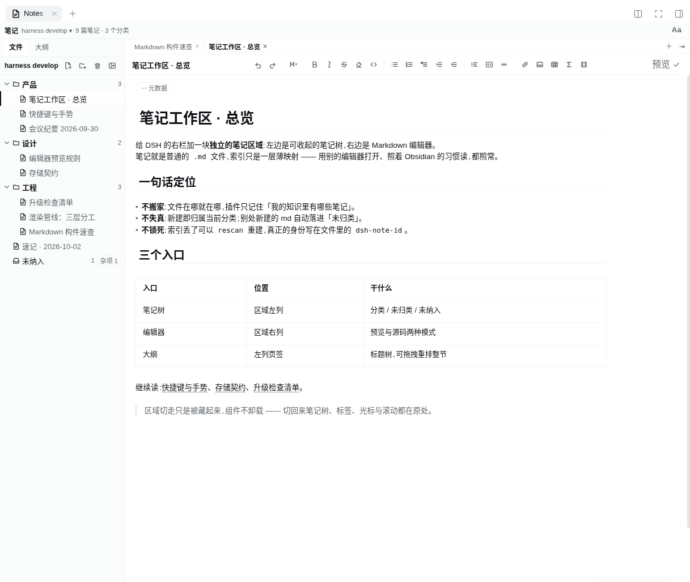
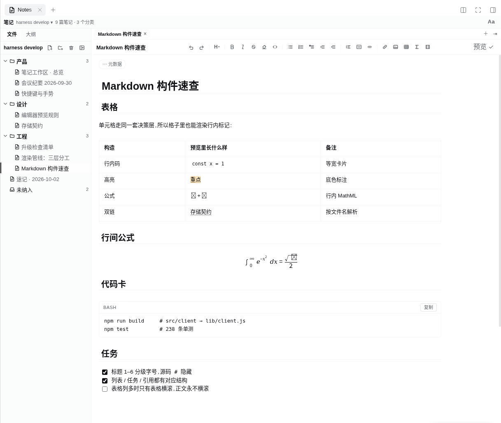
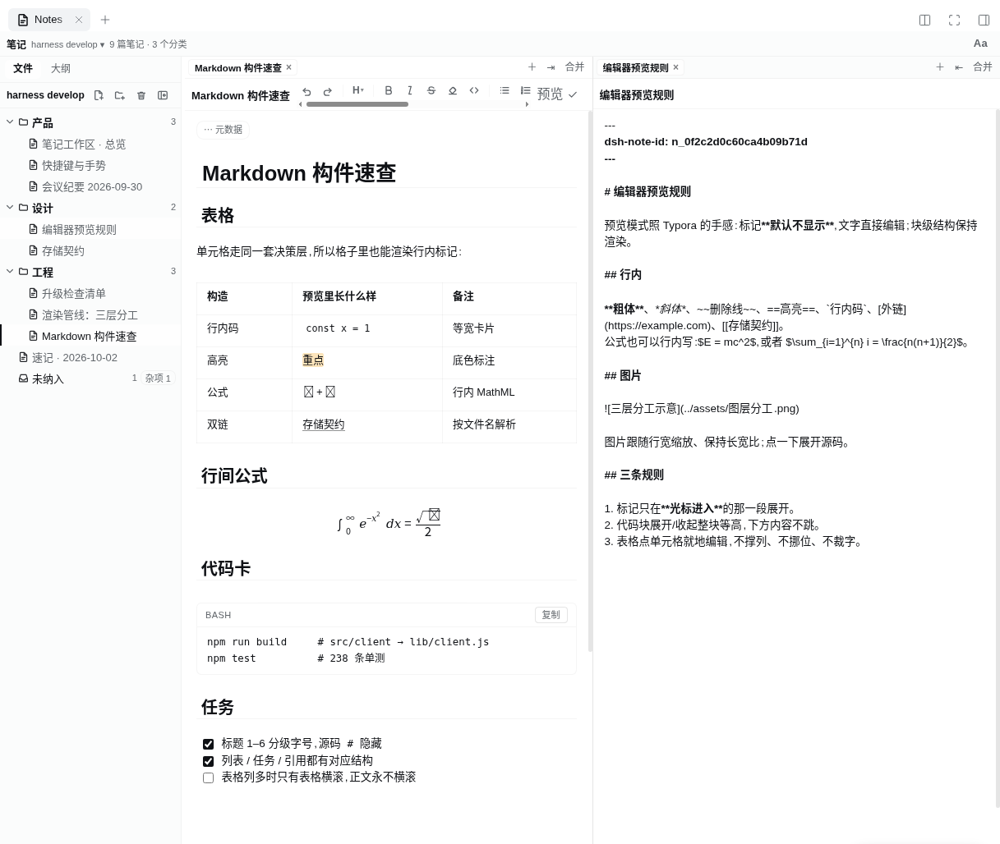
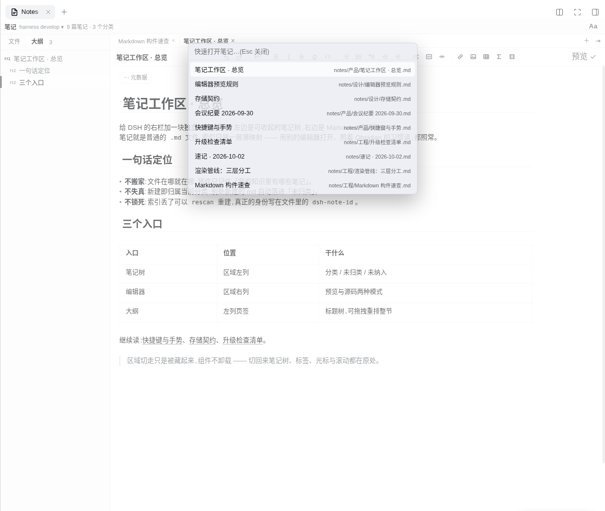
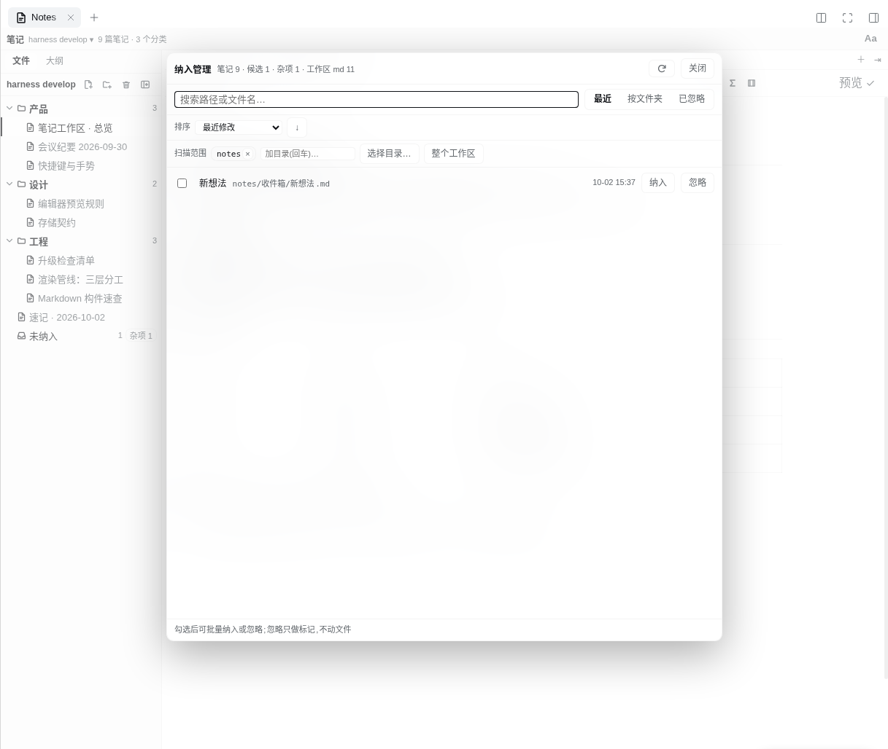
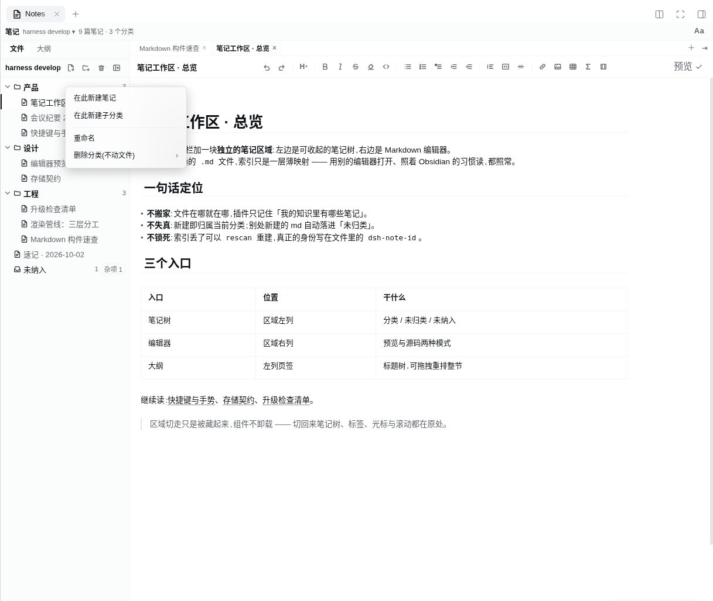
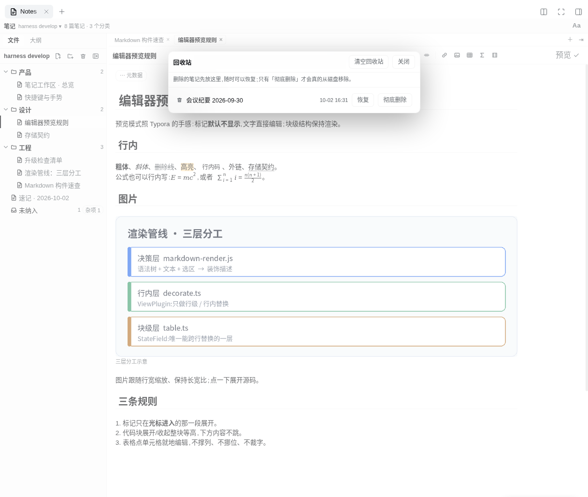

# dsh-notes

**DSH 笔记工作区**:右侧栏一个独立的「笔记」区域 —— 内部左侧是可收起的笔记树,右侧是 Markdown 编辑器。
笔记就是**普通 `.md` 文件**(带一行 `dsh-note-id` frontmatter),索引只是一层**薄映射**;
旧库无需迁移,Obsidian 照常打开。

```
┌───────────────┬──────────────────────────┬──────────────────────────────┐
│ 会话 / 工作区 │        DSH 对话          │  笔记  [树 |▏ 编辑器]        │
│   (左栏)      │      (中央,始终可见)     │  (右栏,一个独立区域)        │
└───────────────┴──────────────────────────┴──────────────────────────────┘
```



## 它解决什么

- **左栏/右栏不再重复**:右栏那棵是「这个项目真实有哪些文件」;笔记区域是「我的知识里有哪些笔记」。
- **笔记树不会失真**:新建即归属当前分类;别处新建的 md 自动落进「未归类」(按磁盘计算,不是靠记得打标签);
  文件被删 → 索引条目直接消失,不复活、不残留幽灵。
- **Agent 原生**:Agent 只多一个 `knowledge` 工具(登记/注销/归类/分类树/未归类/重扫),
  内容操作继续用既有文件工具;当前打开的笔记与中央对话同属一个会话,不需要额外的「笔记 Agent」。
- **按工作区**:一个工作区一棵树;别的工作区的 md 可以**映射**进来,带来源角标。

## 界面预览

下面 7 张图依次对应本 README 的功能段落(区域全貌见页首那张)。截图取自本机运行的 DSH(**中文界面**),
示例笔记是一套虚构的「星图 Aster」知识库 —— 图里出现的都是真实界面,没有手绘 mockup。

### 预览模式



标记默认隐藏、文字直接编辑:标题分级、列表、引用、双链、真表格都在原位渲染,光标进入哪一段才展开源码。

### 表格 / 公式 / 代码卡



单元格里也走同一套渲染(行内码、高亮、`$公式$`、`[[双链]]` 都生效);行间公式是 MathML,**零字体依赖**;
代码卡带语言名与复制按钮。

### 标签栏与分屏



每栏一条自己的标签栏;可左右分屏,**预览/源码逐栏独立**(右栏就是同一篇的源码视图)。

### 大纲与快速打开



左列切到「大纲」是标题树,可拖拽重排整节;区域内 `Ctrl/Cmd+P`(也接受 `Ctrl/Cmd+K`)快速打开。

### 纳入管理



工作区里未纳入的 md 自动落进这里:按时间/名称/路径/大小排序、搜索、多选批量纳入或忽略;
「忽略」只做标记,不动文件,随时可放回。

### 分类右键



分类可**重命名、删除**;删除只改树里的归属 —— 磁盘上一个文件都不碰。

### 回收站



删除 = 移入工作区内的 `.dsh-notes/.trash/`,可恢复;只有「彻底删除」才真的 `unlink`。

## 安装

```bash
# 1) 构建客户端产物
cd "<你克隆 dsh-notes 的目录>"
npm run setup && npm run build     # 首次需要 node_modules 符号链接,见 AGENTS.md

# 2) 装进当前 profile(用 plugin_manager 工具,不要手写 profile)
#    action: install_bundle, target: <本目录绝对路径>
```

装好后右侧栏出现「笔记」(官方 guide 页也有入口胶囊)。插件配置在 profile 的
`cordis.patch.yml` 里覆盖本包那一行(`notesDir` / `assetsDir` / `autosaveMs` / `pasteImage` / `watch` …)。

## 配置

| 键 | 默认 | 含义 |
| --- | --- | --- |
| `notesDir` | `notes` | 笔记根(相对工作区根);「未归类」扫描范围 |
| `assetsDir` | `.dsh-assets` | 粘贴/拖入图片的托管目录(内按 noteId 分目录) |
| `storeScope` | `workspace` | 语义数据放哪:**`workspace` = 工作区内的 `.dsh-notes/`(跟着工作区走)**;`home` = 旧行为,全放 `$DSH_HOME/knowledge/` |
| `storeDir` | 空 | **机器本地**那一份(扫描缓存 / 已知工作区表)放哪;空 = `$DSH_HOME/knowledge` |
| `unfiledDepth` / `unfiledMax` | 3 / 200 | 「未归类」扫描深度与条数上限 |
| `autosaveMs` | 800 | 自动保存静默时长;0 = 关闭 |
| `pasteImage` | `copy` | `copy` 复制进托管目录 / `link` 保持原路径 |
| `watch` | true | 文件监视(改名/删除对账) |

## 编辑器能做什么

预览模式(Typora / Obsidian 手感):标记默认**不显示**,文字直接编辑;块级结构保持渲染。

| 构造 | 行为 |
| --- | --- |
| 标题 1–6 | 分级字号/字重(H1/H2 带下边框);源码 `#` 隐藏 |
| 行内标记 | `**粗**` `*斜*` `~~删~~` `==高亮==` `` `码` `` `[链接]()` `[[双链]]` `$公式$` —— 光标进入才展开源码 |
| 行间公式 | `$$\n…\n$$` 渲染成显示式(**MathML,零字体依赖**;前后不必空行) |
| 代码块 | 圆角卡片 + 语言名/复制按钮 + 语法着色;光标进入 → 展开源码、编辑器本体编辑(**展开/收起整块等高,下方内容不跳**) |
| 表格 | 真 `<table>`,点单元格就地编辑(绝对定位输入框:不撑列、不挪位、不裁字) |
| 图片 | 行内渲染,点一下展开源码 |
| 列表 / 任务 / 引用 | `•` 项目符号、真复选框、引用竖条 |
| 工具栏 | 编辑器上方一行:撤销/重做、标题级别、粗斜删高亮码、列表(无序/有序/任务/缩进)、引用/代码块/分隔线、链接/图片/表格/公式/双链(弹层) |
| 标签栏 + 分屏 | 每栏一条自己的标签栏;点=替换当前标签、Ctrl/Cmd+点击或中键=新标签、⇥=向右分屏(也可拖标签)、Merge 收掉分屏;布局按工作区记住 |
| 大纲 | 左列「大纲」页 = 标题树,可拖拽重排整节 |
| 快速打开 | 区域内 `Ctrl/Cmd+P`(也接受 `Ctrl/Cmd+K`) |
| 源码模式 | 工具栏开关:直接读改磁盘上的纯 markdown |
| 字号 / 图标大小 | 标题栏右上 `Aa`:五档预设 + 滑块 + 复位(**只作用于笔记区**);基准字号跟随「设置 → 通用 → 字体大小」 |
| 不丢字 | 800ms 自动保存;切「预览/源码」、关标签、收分屏、切工作区、关页面都会先把未保存的编辑交出去(关页面走 `sendBeacon`)——切模式不再重读磁盘,刚打的字不会回退 |

**工作区里的 md 分三类**:已纳入(笔记树)/ 候选(未标记)/ 杂项(已忽略)。
树里常驻一行「未纳入」→ 打开**纳入管理**面板:

- **排序**:时间 / 名称 / 路径 / 大小 × 升降序;「最近」默认**按修改时间倒序**,每行显示修改时间;
- 可搜索、多选、批量纳入或忽略,忽略可一键放回;也能按文件夹分组钻取;
- **扫描范围默认只有 `notes/`**(本机实测一次目录枚举约 330ms,整棵树要按分钟算),要看别处就点
  **「选择目录…」浏览着挑**(种子是工作区根,选不到工作区外面去),或者手打工作区相对路径。
  加了根之后会**分批续扫**,界面上能看到进度;整趟没走完时不做"文件没了"的对账。

**分类可以右键重命名、删除**(删除只动树里的归属,**磁盘上一个文件都不碰**:里面的笔记要么上提到
父分类,要么留成未归类)。

**工作区切换**:标题栏显示当前工作区,点一下可切到别的**已登记**工作区(或输入绝对路径打开新目录);
每个工作区有自己的笔记树、标签与分屏布局。

**切走不重载**:右侧栏切到别的 tab、或把整栏收起,笔记区域只是被**藏起来**(组件不卸载)——
笔记树、打开着的标签、光标与滚动都在原处,切回来不会重新拉一遍(「读取中…」只在第一次打开时出现);
隐藏期间也不轮询,切回来立刻对一次账。

**删除 = 移入回收站**:右键「Delete (move to trash)」把文件挪到 `<工作区>/.dsh-notes/.trash/`
(点目录,重扫不会捞回来,**跟着工作区走**)并从索引移除;树工具栏 🗑 的回收站面板可**恢复**或**彻底删除**
(彻底删除要点两次确认)。真正的 `unlink` 只发生在这一步。

**手感与细节(2026-10-01 一轮修复)**:

- **点哪落哪**:从别处粘进来的长段落会折行,以前"不管鼠标怎么点光标都在行的前面";现在按真实
  视觉行定位(单视觉行仍用浏览器原生命中,内联 widget 也准)。
- **表内右键**:删/插行落在**右键那一行**(以前首行删不掉、其余删的是上一行)。
- **改名/新建**:改名后标签标题与路径立即跟上、继续编辑照常保存;树工具栏 ＋ 建了笔记会直接打开。
- **中文界面才显示中文**:代码卡的「复制」、元数据 chip、快速打开等以前写死中文,英文界面下会冒出来,
  现在全部走字典(并有守卫测试盯着)。
- **浮层不再是半透明穿帮**:本主题的 `bg-*` 都是半透明,面板/菜单现在用和宿主菜单同一套材质
  (`--dsw-specific-menu` + `backdrop-filter: blur`),背后正文不再可读。
- **不再无谓写盘**:索引内容没变就不落盘(以前每 ~8s 整份重写一次);一次写失败也不会让后续落盘失效。

## 数据放在哪(换机器怎么用)

插件自己的数据**跟着工作区走** —— 把工作区备份走、或整份拷到另一台机器,装上同一个插件就能原样读出来
(树结构、分类、忽略规则、置顶、回收站都在里面):

```
<工作区>/
├── notes/                       # 你的笔记(标题 = 文件名)
├── .dsh-assets/<noteId>/        # 粘贴/拖入的图片
└── .dsh-notes/                  # 插件数据(自动加了 .gitignore,不进 git status)
    ├── index.json               #   分类树 / 归属 / 忽略 / 置顶 / 跨工作区映射 / 扫描范围
    └── .trash/                  #   回收站(可恢复的删除)
```

机器本地(`$DSH_HOME/knowledge/`)只剩两类**不是你的知识**的东西:扫描缓存(删了只是下次慢一点)、
以及"这台机器见过哪些工作区"(`workspaces.json`,切换工作区列表用)。

- **换机器/换路径**:整份拷过去、用那个目录开会话即可。索引里的笔记与笔记根记的是
  **工作区相对路径**(只有 `root` 是绝对的 —— 它是锚点,也是工作区键的来源),所以搬走 = **零操作**,
  不会出来一堆指向老机器的死路径;旧格式(绝对路径)的文件在第一次打开时自动迁移。
- **`.dsh-notes/` 删了会怎样**:笔记文件本身不丢;重新扫描(`rescan`)能按每篇里的 `dsh-note-id`
  把"哪些文件是笔记"认回来,但**分类树 / 归属 / 忽略规则 / 置顶**只存在于 `index.json`,删了就没了
  (会退化成按文件夹平铺的树)。要备份"人工组织",就带上这个目录。
- **旧版本升级**:第一次打开工作区时,会把 `$DSH_HOME/knowledge/registry.json` 里属于它的那部分
  自动迁进 `.dsh-notes/index.json`,**旧文件原样保留**作备份。
- **不想要工作区里的这个目录**:`storeScope: home` 回到旧行为(全部放 `$DSH_HOME`),
  适合只读/共享仓库;也可以用 `knowledge` 工具的 `migrate` op 在两个位置之间**显式搬运**。
- **标签/分屏布局和字号**故意留在浏览器本地:它们是"这台设备/这个窗口"的偏好,不跟着工作区跑。

## 状态

P0–P4 全部落地,存储改造完成(`node --test test/*.test.mjs` **250** 条;开发与验证步骤见 `AGENTS.md`)。

| 阶段 | 内容 | 状态 |
| --- | --- | --- |
| P0 | 包骨架 + 构建管线 + 右侧栏「笔记」区域外壳(分栏/收起/拖动/主题/i18n) | ✅ |
| P1 | 索引(registry / 工作区键 / watch / 重扫)+ `/dsh-notes/*` 路由 + `knowledge` 工具 + 笔记树 | ✅ |
| P2 | CodeMirror 6 编辑器 + 守卫式保存/自动保存/冲突提示 + 实时预览(语法树驱动 + 自研 lezer 扩展) | ✅ |
| P3 | 树操作(拖放/分类增删改/新建/快速打开/未归类整理)、大纲拖拽 | ✅ |
| P4 | 跨工作区映射角标 / 图片粘贴 / `[[wikilink]]` / 代码卡片 / 真表格 / 公式 / 回收站 | ✅ |
| v0.4.0 | 纳入管理**点选目录** + 排序(时间/名称/路径/大小)+ 分类**重命名/删除** + CRLF 笔记打不开与行尾保真的修复 + 索引改记**相对路径** | ✅ |
| v0.5.0 | 卡片显示「笔记工作区」(locale 形状修正 + 删掉从不生效的 `package.json.meta`)、补 `LICENSE`/`.gitattributes`/`repository` 等 | ✅ |

项目规则与硬不变量见 [`AGENTS.md`](AGENTS.md);本项目已启用 project-context 长期记忆(`.agent-context/`)。

## 图标与显示元数据

DSH 的 `设置 → 插件` 列表会给每个插件画一张卡片。卡片的图标与标题**不来自插件代码**,
而是启动时由 `dsh-app-boot` 的 `readPluginMeta()`（`lib/index.js:1969`）从包资源里读的:

| 来源 | 作用 |
|---|---|
| `package.json.icon` | 相对路径（必须在包目录内、≤256 KiB、支持 svg/png/jpg/webp）→ 读成 data URL 画成卡片图标 |
| `locale/en.json`（锚点）+ `locale/zh.json` | **`{"meta":{"title":…,"description":…}}`**，随语言切换；需在 `exports` 暴露 `"./locale/*.json"` |

三个坑（v0.5.0 之前三个全踩了）:

1. **形状必须是 `meta.title` / `meta.description`**。写成根级 `title` / `description` 时
   `dictionariesOf()` 读不到，标题会静默退回包名、描述退回 `package.json.description`
   —— 而后者恰好是中文，于是"看起来本地化生效了"。
2. **`package.json` 里没有 `meta` 这个字段**。`readPluginMeta()` 只读
   `manifest.icon` / `manifest.name` / `manifest.description`；`manifest.meta` 在
   **0.1.7-alpha.1 与 0.2.0-rc.2 两个 runtime** 里都没有任何消费者（已 grep 确认）。
3. `icon` **不能**写绝对路径或 data URL（会抛错并把插件标成 `meta.error`）；
   `locale/` 目录里**每个** `*.json` 都会被当成一种语言，别放别的 json。

另：`exports` 必须暴露 `"./package.json"`，否则连 meta 都读不到。图标是**启动时**读取的，
改完要重启 `dsh web` 才看得到。

## 热重载（改完不用重启、不用刷新）

本插件的开发目录可以放在工作区里（例如把仓库克隆进工作区），profile 用 `link:` 指向它。
前置两件事（一次性）:

1. profile 里是 **`link:`** 挂载（当前 profile 已是）；
2. profile 的 `cordis.patch.yml` 给 `hmr` 行开模块监听，并**只给 `lib/` 子目录**:

   ```yaml
   - id: hmr
     disabled: false
     config:
       base: <插件目录的父目录>
       root:
         - '<克隆下来的 dsh-notes 目录>/lib'
       # ⚠️ WSL 的 inotify 看不见 /mnt/<盘>（drvfs），必须开轮询
       usePolling: true
       interval: 1000
   ```

之后:

| 改了什么 | 生效方式 |
|---|---|
| `src/client/**` → `npm run build` 产出 `lib/client.js` | `@deepseek-ai/dsh-client-hmr` 每 500ms `stat` 一次 bundle，变了就推新 `rev` → 已打开的页面**就地换模块**，连 F5 都不用（代价：组件内部 state 会丢） |
| `lib/*.js`（Host 半） | `dsh-hmr` 约 1 秒内重新导入并替换插件 fiber，**不用重启** |
| `package.json` / `exports` / 新增依赖 / profile patch 结构 | 仍需重启 |

**两个必须知道的边界**（都在 profile 注释里）:①`root` **只能给很小的子目录** ——
给插件根会让 chokidar 递归整个工作区（实测 6530 个 watch 且持续增长、永不 ready，
把 drvfs/9p 打满，表现是**端口在听但 HTTP 永不应答**）；只给 `lib/` 是 13 个 watch。
②`/mnt/<盘>` 上必须 `usePolling`。

## 兼容性

- **DSH**：本插件的 peer 只有 `@deepseek-ai/cordis` 与 `@deepseek-ai/schemastery`，
  **没有任何 `@deepseek-ai/dsh*` peer** —— 所以它不会被 DSH 0.2 的启动闸门
  （`dsh-app-boot.evaluatePluginCompatibility()`，只校验名字以 `@deepseek-ai/dsh` 开头的 peer）
  判为不兼容，也因此**从来不需要** `compatibility.json` 里的版本豁免。
- **但内部接口面要复核**：本插件驱动的是 DSH 的**内部**服务（`fs` / `tools` / `sessions` /
  `sandboxPolicy` / `sidebarRightTabs` / `slots` / locale）。
  升级 DSH 后先跑 `npm test` 与 `node scripts/build-graph.mjs`，再按 `AGENTS.md`
  的「事实来源」一节用 `cordis_inspect_*` 核对。
- **`dsh.client.inject` 是客户端 fiber 的 `inject`，不是注释。**
  `@deepseek-ai/dsh-client-modules` 会校验它，并把它用作 ①客户端模块图的到达前置、
  ②客户端插件 fiber 的 `inject`（要等这些客户端服务就位才激活）。
  所以**只列这个 bundle 真正必需的服务**：本插件是
  `dsh-client-locale` / `dsh-client-ui-slots` / `dsh-client-ui-sidebar-right` 三项
  （与 `lib/client.js` 自己的 `exports.inject` 一致）。
  可选读取的服务（如 `uiWorkspace`）**绝不能**写进去，否则最小组合里整个插件起不来。
- **平台**：Windows 与 WSL 都实跑过；`link:` 安装时 `node_modules` 必须是指向 profile
  `node_modules` 的符号链接（见 `AGENTS.md`，**别在本目录跑 `npm install`**）。

## 平台支持

插件**只在浏览器里画界面 + 只通过宿主的 `fs` 服务读写文件**：自己不起进程、不碰原生模块、
没有 postinstall，所以三个平台跑的是同一份代码。已实测的两条、以及 macOS 的诚实边界：

| 平台 | 状态 | 证据 |
| --- | --- | --- |
| **WSL / Linux** | ✅ 开发与日常使用 | `npm test` **250 条**全绿（Ubuntu 24.04 · node 22.19） |
| **Windows** | ✅ 单测全绿（**真实 Windows 文件系统**） | 32 个测试文件 **208 条**全绿（node 22.14；在 `%TEMP%` 上真建/真读/真改名/真删除，回收站与行尾保真都跑到） |
| **macOS** | ⚠️ 代码级推理，**没有真机** | 与 Linux 走同一条 POSIX 分支；下面列出的差异已在代码里处理，但未经真机验证 |

怎么跑的（可复现）：Windows 侧用 WSL interop 调那一侧的 node 直接指向本仓库 ——
`powershell.exe -Command "Set-Location -LiteralPath 'D:\…\dsh-notes'; node --experimental-strip-types --test <除 4 个需要 harness 依赖的文件外的全部>"`。
那 4 个文件（`markdown-render` / `markdown-syntax` / `cell-inline` / `service-api`）要 `@lezer/*`
与 `@deepseek-ai/*`，只能在装了 profile 的那一侧跑；它们是纯字符串/渲染逻辑，与平台无关。

### 内部只有一种路径写法

插件内部、以及返回给界面与索引的路径，**一律 `/` 分隔**（`lib/notes.js` 的 `toPosix`）。
原因很实际：Windows 上 `node:path` 的 `join()` 产出 `\`，不归一就会出现「同一个目录两种写法」，
字符串比较与集合键随即静默失配（2026-10-02 实测：Windows node 上 12 条测试红，全部是 `C:/…` vs `C:\…`）。

`test/platform-paths.test.mjs` 把这条钉成可执行的约定，而且**喂的是 Win32 输入的字符串** ——
所以在 Linux 上跑也照样能抓到回归（注入一次原生 `join` 验证过：立刻 1 条红）。
宿主与 Win32 API 都接受 `/`，所以归一之后**不需要**在调用前换回 `\`。

### 已经处理掉的三平台真实差异

- **Windows 保留设备名**：`CON` / `PRN` / `AUX` / `NUL` / `COM1`–`COM9` / `LPT1`–`LPT9`，
  含 `CON.md` 这种**带后缀也保留**的写法 → 生成文件名时让开（`CON` → `CON-`，`CON.md` → `CON-.md`）。
- **尾随点与空格**（Windows 会静默截断）、非法字符 `\ / : * ? " < > |`、控制符 → 都在
  `sanitizeFileName()` 里处理；长度按 80 个字符封顶，宽字符下也远低于 ext4 的 255 字节单组件上限。
- **盘符大小写不敏感**：`c:\ws` 与 `C:\ws` 是同一个工作区 → 路径比较对盘符段忽略大小写
  （POSIX 路径仍严格区分大小写，这是有意的，也测了）。
- **行尾**：CRLF 笔记保存时不会把整份文件的行尾改写（`detectEol` / `applyEol`），这条在 Windows 上也跑过。
- **目录选择器的面包屑**：官方给的 `crumbs[].path` 与我们会话里的 cwd 可能大小写不同 →
  按「互相都能相对化」匹配，而不是字符串相等。

### 已知边界（没在代码里赌）

- **macOS 的 Unicode 归一化**：HFS+ 会做 NFD 归一化，带重音/组合字符的**文件名**在极端情况下
  可能出现两种拼写（APFS 好得多）。插件认的是 frontmatter 里的 `dsh-note-id`，所以最坏结果是
  树里多一条；没有真机，不臆造结论。
- **超长路径**：Windows 的 260 字符上限受「长路径支持」开关影响；插件已把单段限制在 80 字符，
  但工作区根本身很深时仍可能触顶（那是宿主 `fs` 报错，不是插件逻辑）。
- **安装方式**：`dsh plugin add` 装的是仓库里**已构建**的 `lib/client.js`，用户机器上不需要 esbuild
  —— `npm run setup` / `npm run build` 只给开发用。
